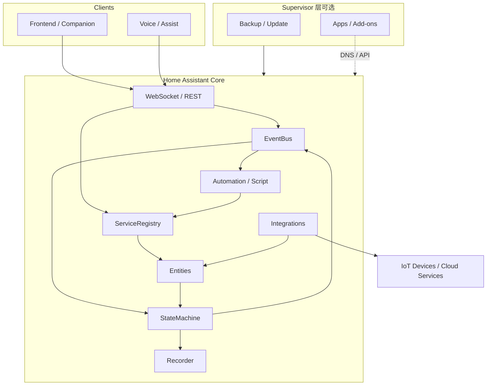

# Home Assistant 软件架构洞察

> 基于官方开发者文档与 Core 源码结构（`home-assistant/core`）整理。  
> 参考：[Architecture overview](https://developers.home-assistant.io/docs/architecture_index/) · [Core](https://developers.home-assistant.io/docs/architecture/core/) · [Integrations](https://developers.home-assistant.io/docs/architecture_components/) · [Entities](https://developers.home-assistant.io/docs/architecture/devices-and-services/) · [Frontend](https://developers.home-assistant.io/docs/frontend/architecture/) · [Supervisor](https://developers.home-assistant.io/docs/supervisor/)

---

## 1. 一句话本质

Home Assistant 是一套**事件驱动的嵌入式家居控制平台**：以 Python asyncio Core 为中枢，用 Event Bus 解耦集成；用统一的 Entity / Device / Service 抽象屏蔽厂商差异；用 Supervisor + OS 把“应用”升级成“可更新的家用设备体验”。

### 关键字速览（架构特征）

| 关键字 | 含义 |
|--------|------|
| **事件驱动** | Event Bus 是系统心跳；组件只听/发事件，互不硬依赖 |
| **状态中枢** | State Machine 是当前世界的真相源；变更即广播 `state_changed` |
| **领域标准化** | `light` / `switch` 等 Domain Entity 统一跨品牌控制语言 |
| **可插拔集成** | Integration + Config Entry 动态扩展，不改 Core |
| **异步优先** | asyncio 主循环 + Executor 隔离阻塞 I/O |
| **分层可裁剪** | OS → Supervisor → Core → Frontend，按部署形态增减能力 |
| **单向实时 UI** | Frontend 经 WebSocket 镜像 `hass`，不持业务真相 |

一串记：**事件驱动 · 状态中枢 · 领域标准化 · 可插拔 · 异步 · 分层栈 · 实时镜像**

---

## 2. 产品栈分层（从下到上）

```
┌─────────────────────────────────────────────────────────┐
│  Frontend (Lit Web Components) + Mobile / Voice Clients │
│  WebSocket / REST API                                    │
├─────────────────────────────────────────────────────────┤
│  Home Assistant Core (Python / asyncio)                  │
│  EventBus · StateMachine · ServiceRegistry · Timer       │
│  Integrations / Entities / Automations / Recorder        │
├─────────────────────────────────────────────────────────┤
│  Supervisor                                              │
│  管理 Core / Apps(原 Add-ons) / 备份 / 更新 / 回滚       │
├─────────────────────────────────────────────────────────┤
│  Docker + Home Assistant OS (或 Container / Core 精简栈) │
│  DNS · Audio · mDNS · D-Bus · Network Manager            │
└─────────────────────────────────────────────────────────┘
```

| 层级 | 职责 |
|------|------|
| **HA OS** | 最小 Linux，专为跑 Supervisor + Core |
| **Supervisor** | 跑/更 Core、装 Apps、备份恢复、统一音频、更新 OS |
| **Core** | 与用户、Supervisor、IoT 设备交互的真正自动化引擎 |
| **Frontend** | Web Components UI，经 WebSocket 单向同步 `hass` 状态 |

安装形态可裁剪：OS（完整）→ Supervised → Container → Core（仅引擎）。能力随 Supervisor/OS 缺席而减少（无 Apps、OS 更新等）。

---

## 3. Core 四大基石

`HomeAssistant`（惯称 `hass`，`homeassistant/core.py`）聚合运行时：

| 属性 | 类型 | 作用 |
|------|------|------|
| `hass.bus` | `EventBus` | 事件总线：系统心跳，组件间松耦合通信 |
| `hass.states` | `StateMachine` | 实体当前状态；变更即发 `state_changed` |
| `hass.services` | `ServiceRegistry` | 注册/调用服务动作（如 `light.turn_on`） |
| `hass.config` | `Config` | 位置、单位、配置目录等核心配置 |
| `hass.config_entries` | `ConfigEntries` | 集成实例（如某一台 Hue Bridge）生命周期 |
| `hass.data` | `HassDict` | 集成私有共享数据 |

外加 **Timer**：每秒向总线发 `time_changed`，驱动时间类触发器。

### 3.1 事件驱动主路径

```
设备/集成 ──写状态──▶ StateMachine ──fire──▶ EventBus
                                              │
                    Automation / Script / UI ◀─┘ listen
                                              │
                    ServiceRegistry ◀── call_service 事件
                                              │
                    设备控制 / 状态回写 ◀──────┘
```

设计要点：

- **发布-订阅**：集成互不直接依赖，只听/发事件。
- **状态是真相源**：UI、自动化、历史都以 State Machine 为准。
- **服务是写操作入口**：调用服务 → 集成执行 → 状态回写 → 再发事件。

### 3.2 作业模型（HassJob）

三类工作统一封装：

1. **`@callback`**：同步、快速，跑在事件循环上  
2. **Coroutine**：`async` 逻辑  
3. **Executor**：阻塞 I/O 丢线程池  

保证主循环不被阻塞，是高集成数量下仍可响应的关键。

### 3.3 生命周期（CoreState）

启动：bootstrap → 分阶段加载集成 → `EVENT_HOMEASSISTANT_START` → `RUNNING`  
关闭：Stopping → Stop → Final Write → Close（有序落盘）

---

## 4. 集成（Integration）架构

每个集成对应一个 **domain**，由 `manifest.json` 声明依赖与需求，经 `loader.py` / `setup.py` 加载。

### 4.1 四类集成

| 类型 | 例子 | 角色 |
|------|------|------|
| **定义 IoT 域** | `light` / `switch` / `sensor` | 规定状态字段与标准控制动作 |
| **对接外部设备/服务** | Hue、MQTT、ZHA、ESPHome | 连真实世界，落到标准 Entity |
| **虚拟/计算数据** | `input_boolean`、`template`、`utility_meter` | 纯软件实体或派生量 |
| **自动化逻辑** | `automation`、`script`、`flux` | 响应事件、执行动作 |

### 4.2 Component + Platform

- **Component**：集成根逻辑（`async_setup` / `async_setup_entry`）  
- **Platform**：把设备挂到某个域（如 `hue/light.py` → `LightEntity`）

设备集成（Hue）持有连接；实体集成（`light`）定义抽象类与标准服务；`EntityComponent` / `EntityPlatform` 负责分发配置、发现、轮询与注册。

### 4.3 Config Entry（现代配置模型）

`ConfigEntry` = 某集成的一次安装实例（一台网桥、一个账号）。

常见状态：`LOADED` / `SETUP_RETRY` / `SETUP_ERROR` / `NOT_LOADED`  

用户经 **Data Entry Flow**（UI 向导）创建条目，替代大量 YAML；YAML 仍可用于高级/遗留场景。

---

## 5. 实体与注册表：数据层级

```
Floor（楼层）
  └── Area（区域，如客厅）
        └── Device（物理设备）
              └── Entity（可观测/可控数据点）
                    └── State（当前值 + attributes）
```

| 概念 | 含义 |
|------|------|
| **Entity** | 传感器、开关、灯等最小控制单元；继承 `helpers/entity.py` |
| **Device** | 多个 Entity 的物理聚合（一台插座上的功率+开关） |
| **Entity Registry** | `unique_id` ↔ `entity_id`，保留用户重命名/禁用 |
| **Device Registry** | 设备元数据、厂商、关联 Area |
| **Area / Floor / Label** | 空间与标签组织 |

关键抽象：集成实现属性与控制方法；基类负责格式化并写入 State Machine。实体对象不在时，Registry 可写 `unavailable`。

控制流：

```
UI/自动化 → service call（light.turn_on）
         → Entity 方法（async_turn_on）
         → 厂商 API
         → 写回 State → state_changed → 订阅者更新
```

---

## 6. 自动化引擎

Automation 本身也是集成，模式为 **Trigger → Condition → Action**：

- **Trigger**：听 `state_changed` / `time_changed` / 事件 / 设备触发等  
- **Condition**：模板、状态、时间等守卫  
- **Action**：调用服务、延迟、选路、嵌套脚本  

集成可自带 Trigger 平台（`Trigger` + `async_attach_runner`），与 Core 事件模型对齐。Context 贯穿事件链，用于追踪“谁触发了什么”。

---

## 7. Frontend 架构

技术栈：**Lit Web Components**，单向数据流。

| 部分 | 入口 | 职责 |
|------|------|------|
| Bootstrap | `core.ts` | 鉴权、建 WebSocket，并行拉数据与 UI |
| App Shell | `app.ts` / `home-assistant.ts` | 根状态、导航、侧栏 |
| Panels | `src/panels/` | 各页面（Overview、History、Settings…） |
| Dialogs | `src/dialogs/` | more-info、配置流等浮层 |

- 根组件持有 `hass`，向下传递；子组件按需订阅 WebSocket。  
- **去中心化路由**：父组件只解析自己负责的 URL 段。  
- 改后端（开灯）→ 服务端推状态 → 根 `hass` 更新 → 树重渲染。

---

## 8. Supervisor 与运行时边界

Supervisor 职责：

- 运行与更新 Core（失败自动回滚）  
- 备份 / 恢复  
- 安装运行 **Apps**（原 Add-ons，独立 Docker 容器）  
- 统一音频；在 HA OS 上还可更新操作系统  

配套基础设施：Docker、内部 DNS（Core ↔ Apps）、Audio、mDNS、D-Bus。

**洞察**：Core 专注自动化语义；Supervisor 专注“家电式运维”。两者通过 API/集成（如 `hassio`）协同，而不是把运维逻辑塞进 Core。

---

## 9. 数据持久化与对外 API

| 子系统 | 作用 |
|--------|------|
| **Recorder** | 状态/事件写入数据库（默认 SQLite，可 PostgreSQL 等），支撑 History / 统计 |
| **Storage helpers** | `.storage/` JSON，存 Registry、Config Entries 等 |
| **Backup** | Supervisor 或 Core backup 集成打包配置与数据 |
| **WebSocket API** | `/api/websocket`：实时订阅、调服务、触发器订阅（前端主通道） |
| **REST API** | 状态查询、部分配置 CRUD 等 |

---

## 10. 关键设计洞察

### 10.1 总线是脊柱，状态是血液

几乎所有扩展点都挂在 Event Bus 上；State Machine 让“当前世界”可查询、可订阅。新集成默认不改 Core，只注册监听与服务。

### 10.2 双层标准化（Domain Entity + Brand Integration）

- Domain（`light`）统一用户心智与自动化语言  
- Brand（`hue`）封装协议与硬件差异  

同一自动化可写 `light.turn_on`，无需知道底层是 Hue、Zigbee 还是 MQTT。

### 10.3 配置从 YAML 迁到 Config Entry + Flow

降低上手成本，同时保留 YAML 给高级用户；Config Entry 使多实例、重载、重试成为一等公民。

### 10.4 异步优先 + 明确阻塞边界

asyncio 主循环 + Executor 隔离阻塞调用，支撑成百上千集成共存。

### 10.5 产品化分层（OS / Supervisor / Core / UI）

同一套 Core 语义，可按部署需求裁剪栈深度；完整栈提供“开箱即用的家用设备”体验。

### 10.6 前端与后端契约清晰

Frontend 不持业务真相，只镜像 `hass`；实时性靠 WebSocket，利于多客户端（Web、Companion、语音）一致。

---

## 11. 源码导航地图（Core）

| 路径 | 内容 |
|------|------|
| `homeassistant/core.py` | `HomeAssistant`、EventBus、StateMachine、ServiceRegistry |
| `homeassistant/bootstrap.py` | 启动编排 |
| `homeassistant/loader.py` / `setup.py` | 集成发现与加载 |
| `homeassistant/config_entries.py` | Config Entry 生命周期 |
| `homeassistant/helpers/entity.py` | Entity 基类 |
| `homeassistant/helpers/*_registry.py` | Entity / Device / Area 等注册表 |
| `homeassistant/components/` | 内置集成（含 `light`、`automation`、`recorder`…） |
| `homeassistant/components/<brand>/` | 厂商集成 + platforms |

Frontend 独立仓库 `home-assistant/frontend`；Supervisor 为 `home-assistant/supervisor`；OS 为 `home-assistant/operating-system`。

---

## 12. 架构总图（逻辑）



---

## 13. 小结

Home Assistant 的架构竞争力不在单一协议支持，而在：

1. **事件总线 + 状态机** 形成可扩展中枢；  
2. **Domain Entity 标准化** 统一跨品牌控制语言；  
3. **Config Entry / Registry** 管理规模化实例与用户元数据；  
4. **Supervisor 栈** 把开源引擎包装成可维护的家用系统；  
5. **WebSocket 单向 UI** 保证多端实时一致。

理解这五层，即可定位：写集成从 Entity/Config Entry 入手；写自动化吃事件与服务；做运维站在 Supervisor；做客户端只消费 WebSocket/REST 与状态模型。
